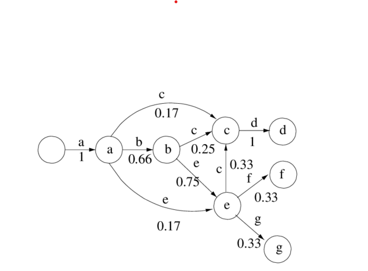
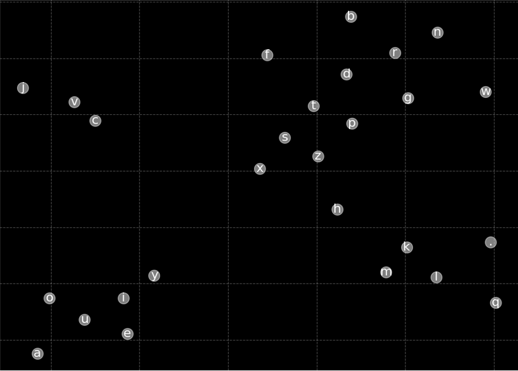
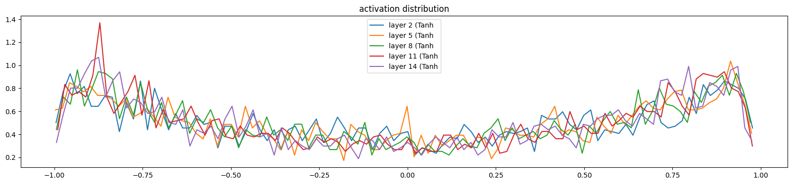
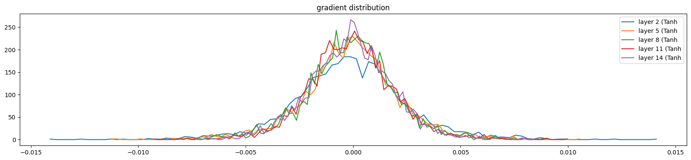

# Character-Level-Language-Modeling-using-different-deep-learning-architectures

## Project Overview :
The model generates new text based on the patterns learned in a training data.It can be applied to various tasks, such as generating creative names (e.g., company or baby names) or producing text that mimics a given dataset, making it a versatile tool for autoregressive text generation. This implementation is inspired by Andrej Karpathy's makemore.

## Key elements :

- **Bigram Character-Level Language Model for Name Generation:**
  
We explored a fundamental approach based on bigram probabilities to capture sequential character dependencies. Initially, we constructed a simple probabilistic matrix that models the likelihood of a character given the previous one, then we built a simple neural network architecture that learns these dependencies more effectively as an introduction for the next architectures.


- **MLP-Based Character-Level Language Model:**

Building on the bigram model, we implemented a more sophisticated architecture using a multi-layer perceptron (MLP). We experimented with different configurations, particularly varying the number of hidden layers. A key enhancement was the inclusion of an embedding layer that maps each character to a 10-dimensional vector representation, which provides a dense and meaningful encoding for character-level information.

To visualize these embeddings, we applied t-SNE for dimensionality reduction, resulting in insightful 2D representations that revealed character clustering patterns based on learned semantic relationships.




We manually constructed several layers to gain a deeper understanding of the inner workings of the PyTorch library. To tackle the vanishing gradient problem, we explored the importance of weight initialization and batch normalization. Our chosen activation function was Tanh(), where we aimed to minimize saturation by ensuring the activation distribution did not saturate at 1.



Additionally, we visualized the gradients to mitigate the risk of exploding gradients.



## Setup and Execution :
Go to the desired architecture in the **src** :

1. Create a Virtual Environment::

```bash
python -m venv venv
venv\Scripts\activate
```

2. Install Requirements::

```bash
pip install -r requirements.txt
```

3. Execute the Model::

```bash
python main.py
```
